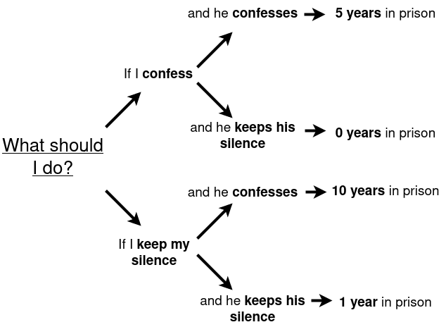

# Prisoner's Dilemma


Context of the game: Two robbers get arrested by the police. The police has sufficient proof of a lesser charge but not of the bigger crime. The police separates the robbers in two cells so that they can't communicate and then offers them a plea deal: If they snitch on the other they get away free.

In this setup "cooperation" is defined as "keeping silence", "defection" is defined as colaborating with the police (taking the plea deal)

Options:
* Player `A` cooperates, player `B` cooperates -> They both get 1 year in prison, for the lesser charge.
* Player `A` cooperates, player `B` defects -> PLayer `A` gets 20 years in prison, player `B` gets away free.
* Player `A` defects, player `B` cooperates -> Player `A` gets away free, player `B` gets 20 years in prison.
* Player `A` defects, player `B` defects -> They both get 5 years in prison, for both charges.

```
          | Cooperate | Defect  |
---------------------------------
Cooperate |   (1, 1)  | (20, 0) |
---------------------------------
Defect    |  (0, 20)  | (5, 5)  |
---------------------------------

```



If the game is played an undefined number of iterations (Iterated Prisoner's Dilemma) there might be an incentive to cooperation, since if possible, it could pay off in the long run.

This repository contains the implementation of 8 strategies found in `utils/players.py`. Please note this implementation may not be the same as in Axelrods' tournament. The strategies implemented are:

* *Tit4Tat*: start cooperating then do the previous move from the opponent
* *Tit42Tat*: start cooperating then do the same move as the opponent 2 turns ago.
* *Cooperator*: always cooperate
* *Defector*: always defect
* *Resentful*: cooperate always, if opponent defected at any point then always defect
* *Tester*: defect first, then if retaliation turn to cooperation, otherwise continue defecting
* *Majority*: cooperate first, then do as the opponent does the most
* *Random*: Randomly cooperate or defect, with 1/2 probability 

more information: https://en.wikipedia.org/wiki/Prisoner's_dilemma


## Installation 
------------------------------
1. Clone the repository: ```git clone https://github.com/raulorteg/prisoners_dilemma```
2. Create the python virtual environment (I use python 3.9.14): ```virtualenv  prison_dilemma```
3. Activate virtualenv  ```source prison_dilemma/bin/activate```
4. Install requirements ```python -m pip install -r requirements.txt```

## Requirements
------------------------------

see the ```requirements.txt``` file


## Usage
------------------------------

In `/scripts` you may find the script prepared to run the simulation.

```bash
python run.py
```

Use the flag `--verbose` for increased verbosity (_e.g python run.py --verbose_)

The default printout contains the scoring matrix of the results of each individual pairing (SCORING MATRIX), then the LEADER BOARD is printed
out by summing up the total years accumulated by each of the strategies (row-wise). The objective is to accumulate the least amount of years.

Example of the printout (without verbosity):


```
SCORING MATRIX:

        | Tit4Tat  |  Tit42Tats  |  Cooperator  |  Defector  |  Resentful  |  Tester  |  Majority |  Random
----------------------------------------------------------------------------------------------------
Tit4Tat | (100, 100) | (100, 100) | (100, 100) | (515, 495) | (515, 495) | (515, 495) | (100, 100) | (667, 647) | 
----------------------------------------------------------------------------------------------------
Tit42Tats | (100, 100) | (100, 100) | (100, 100) | (530, 490) | (530, 490) | (530, 490) | (100, 100) | (678, 638) | 
----------------------------------------------------------------------------------------------------
Cooperator | (100, 100) | (100, 100) | (100, 100) | (2000, 0) | (100, 100) | (2000, 0) | (100, 100) | (1050, 50) | 
----------------------------------------------------------------------------------------------------
Defector | (500, 500) | (500, 500) | (0, 2000) | (500, 500) | (500, 500) | (0, 2000) | (500, 500) | (260, 1220) | 
----------------------------------------------------------------------------------------------------
Resentful | (100, 100) | (100, 100) | (100, 100) | (515, 495) | (515, 495) | (515, 495) | (100, 100) | (191, 1371) | 
----------------------------------------------------------------------------------------------------
Tester | (104, 104) | (495, 515) | (0, 2000) | (1985, 5) | (1985, 5) | (0, 2000) | (218, 98) | (220, 1340) | 
----------------------------------------------------------------------------------------------------
Majority | (100, 100) | (100, 100) | (100, 100) | (515, 495) | (515, 495) | (515, 495) | (100, 100) | (379, 1079) | 
----------------------------------------------------------------------------------------------------
Random | (292, 292) | (683, 663) | (48, 1088) | (1235, 255) | (1250, 250) | (1250, 250) | (1186, 266) | (599, 699) | 


LEADER BOARD: 

Position    Strategy    Total score
----------------------------------------
#1/8        Resentful   2136
#2/8        Majority   2324
#3/8        Tit4Tat   2612
#4/8        Tit42Tats   2668
#5/8        Defector   2760
#6/8        Tester   5007
#7/8        Cooperator   5550
#8/8        Random   6543
```

## Code formatting
Use isort 5.10.1 and black 22.10.0:
```bash
python -m pip install isort==5.10.1 black==22.10.0 
```

Sort the imports:
```bash
python -m isort <file_or_directory>
```


To format:
```bash
python -m black <file_or_directory>
```